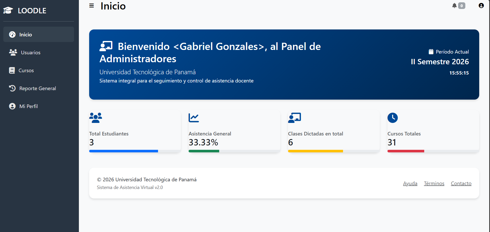
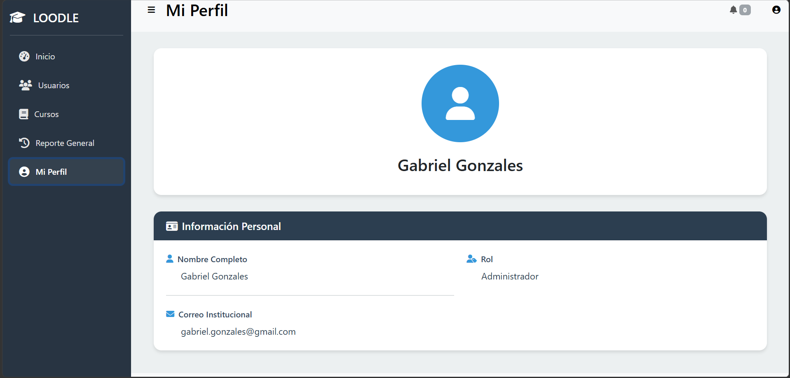
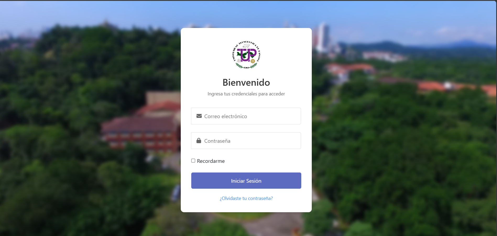
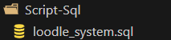

# LOODLE - Pendientes y anotaciones del proyecto

## 1. Funcionalidades pendientes y ajustes

### Panel de administrador

* Agregar estudiantes desde el panel de administrador.
* Agregar profesores desde el panel de administrador.
* Validar correctamente los datos antes de registrar un usuario.
* Evitar registros duplicados.
* En la sección de usuarios permitir editar el rol del usuario:

  * Administrador
  * Profesor
  * Estudiante
* En la sección de estudiantes permitir editar información propia del estudiante:

  * Curso
  * Grupo
  * Otras relaciones académicas necesarias.
* En la sección de profesores permitir editar información propia del profesor.
* Permitir gestionar correctamente las relaciones entre profesores y cursos.
* Verificar que los cambios realizados desde el panel se reflejen correctamente en las relaciones del sistema.
* Revisar las opciones de eliminación y confirmar correctamente las acciones antes de ejecutarlas.




### Perfil de usuario

Cada usuario debe poder administrar determinados datos de su propia cuenta desde su perfil.

Debe existir una opción para cambiar la contraseña para todos los roles:

* Estudiante: puede cambiar su propia contraseña.
* Profesor: puede cambiar su propia contraseña.
* Administrador: puede cambiar su propia contraseña.

Proceso de cambio de contraseña:

* Solicitar contraseña actual.
* Solicitar nueva contraseña.
* Solicitar confirmación de nueva contraseña.
* Verificar que la contraseña actual sea correcta.
* Verificar que la nueva contraseña cumpla los requisitos establecidos.
* Verificar que ambas nuevas contraseñas coincidan.
* Guardar la nueva contraseña utilizando `password_hash()`.
* No almacenar ni mostrar contraseñas en texto plano.
* Mostrar mensaje de éxito o error.
* Evaluar cerrar la sesión después del cambio para solicitar un nuevo inicio de sesión.

Diferenciar:

* Cambio de contraseña: el usuario está dentro de su cuenta y conoce su contraseña actual.
* Recuperación de contraseña: el usuario no puede iniciar sesión y necesita recuperar el acceso mediante correo electrónico y un token temporal.



### Asistencia

* Revisar el flujo completo de registro de asistencia.
* Verificar que solamente los usuarios autorizados puedan registrar o modificar asistencia.
* Revisar edición de asistencia.
* Revisar historial de asistencia.
* Verificar correctamente los porcentajes de asistencia.
* Revisar estados utilizados para representar la asistencia.
* Verificar que los datos mostrados en reportes coincidan con los registros reales.
* Revisar posibles duplicados de asistencia.

### Cursos y profesores

* Revisar asignación de profesores a cursos.
* Verificar que un profesor solamente pueda acceder a los cursos que realmente tiene asignados.
* Revisar las relaciones entre profesores, cursos, grupos y estudiantes.
* Evitar relaciones duplicadas.
* Validar que los cambios realizados desde el administrador no generen inconsistencias.

### Reportes y estadísticas

* Revisar reportes de asistencia.
* Revisar estadísticas y porcentajes.
* Verificar que los cálculos sean correctos.
* Revisar exportación a CSV.
* Comprobar que los datos exportados coincidan con los mostrados en el sistema.
* Revisar posibles consultas repetidas o innecesariamente pesadas.

### Notificaciones y correo

* Mantener el sistema actual de notificaciones por correo.
* Verificar correctamente el envío mediante PHPMailer.
* Revisar mensajes y errores cuando el envío falle.
* Revisar la relación entre notificaciones y usuarios.
* Evaluar implementar correctamente estado de leído/no leído si forma parte del flujo final.

### Recuperación de contraseña

Si todavía no está implementada:

* Crear opción "¿Olvidaste tu contraseña?".
* Solicitar correo electrónico.
* Generar token temporal y seguro.
* Enviar enlace mediante correo.
* Establecer tiempo de expiración del token.
* Permitir establecer una nueva contraseña.
* Invalidar el token después de utilizarlo.
* Evitar reutilización de tokens.



---

## 2. Seguridad y permisos

Revisar que las restricciones no dependan únicamente de ocultar botones o menús.

* Validar permisos desde el backend.
* Verificar el rol del usuario en cada operación protegida.
* Impedir acceso directo mediante URL a módulos que el usuario no tenga permitido utilizar.
* Verificar permisos también en las solicitudes POST.
* Impedir que un usuario modifique información perteneciente a otro usuario cuando no tenga autorización.
* Validar correctamente los IDs recibidos desde formularios y URLs.
* Revisar sesiones.
* Revisar cookies y configuración de sesión.
* Revisar tokens utilizados para autenticación o recuperación.
* Implementar protección CSRF donde corresponda.
* Revisar acciones destructivas.
* Solicitar confirmación antes de eliminar información.
* No guardar credenciales ni secretos dentro del código.
* Mantener las credenciales en `.env`.
* Revisar información sensible que pueda estar presente en archivos SQL, repositorios o archivos de configuración.

---

## 3. Base de datos

Revisar la estructura actual de `loodle_system`.



* Revisar claves foráneas.
* Revisar relaciones entre tablas.
* Evitar registros duplicados.
* Evaluar restricciones `UNIQUE` donde correspondan.
* Revisar la relación profesor-curso.
* Revisar la relación estudiante-curso/grupo.
* Agregar índices donde realmente sean necesarios.
* Revisar integridad referencial.
* Revisar consultas que puedan generar datos inconsistentes.
* Utilizar transacciones en operaciones que involucren varios registros y deban completarse como una sola operación.
* Revisar especialmente el registro de asistencia para evitar guardar información parcialmente cuando una operación falle.
* 

---

## 4. Estructura y código

El sistema actualmente funciona, pero existen partes que pueden mejorar en organización y mantenimiento.

Revisar:

* Código duplicado.
* Lógica repetida entre modelos/repositorios/controladores.
* Diferentes formas de manejar usuarios y sesiones.
* Código antiguo que ya no sea utilizado.
* Consultas SQL directamente dentro de vistas.
* Separación entre lógica, acceso a datos y presentación.
* Organización de controladores, modelos, repositorios y vistas.
* Nombres y convenciones utilizados en el proyecto.
* Formato y consistencia del código.

No es necesario reconstruir LOODLE desde cero.

El objetivo es mejorar progresivamente la estructura existente sin romper las funcionalidades que ya funcionan.


======================================================================================

## Pendiente - Horario automático del estudiante

Al asignar un estudiante a un curso/grupo, el curso debe aparecer automáticamente en su calendario según el horario correspondiente.

Actualmente, el curso no aparece hasta que se crea manualmente una clase asociada al estudiante.

Revisar posteriormente la relación entre estudiantes, cursos, grupos, horarios y la tabla `clases`.

Objetivo:

- No crear clases manualmente por cada estudiante.
- El horario debe depender del curso/grupo al que pertenece el estudiante.
- Al agregar o cambiar de curso/grupo, el calendario debe actualizarse automáticamente.
- Evitar duplicar clases por estudiante.
- ======================================================================================

---

## 5. Rendimiento

Después de terminar las funcionalidades pendientes, revisar el rendimiento real del sistema.

* Identificar consultas lentas o repetidas.
* Revisar consultas de dashboards.
* Revisar consultas de reportes.
* Revisar estadísticas.
* Revisar consultas que se ejecuten una vez por cada estudiante o registro.
* Revisar índices.
* Evitar consultas innecesarias.
* Revisar carga repetida de recursos.
* Revisar el uso de iframes y su impacto en la carga.
* Medir primero los problemas reales antes de optimizar código innecesariamente.

Objetivo:

Que el sistema responda de forma rápida y consistente, especialmente en dashboards, asistencia, historial y reportes.

---

## 6. Responsive

Revisar el sistema en:

* Computadora.
* Tablet.
* Teléfono.

Revisar especialmente:

* Sidebar.
* Dashboard.
* Tablas.
* Formularios.
* Modales.
* Botones.
* Gráficas.
* Calendario.
* Alertas.
* Menús.
* Elementos con información extensa.

Evitar:

* Desbordamientos horizontales.
* Botones imposibles de utilizar desde móvil.
* Tablas ilegibles.
* Formularios demasiado anchos.
* Elementos superpuestos.
* Contenido cortado.

## 7. Diseño y experiencia de usuario

Unificar visualmente el sistema.

Revisar:

* Colores.
* Tipografías.
* Tamaños.
* Botones.
* Espaciados.
* Formularios.
* Tablas.
* Iconos.
* Alertas.
* Mensajes.
* Estados vacíos.
* Navegación.

Cada rol debe tener una experiencia coherente con las funciones que realmente necesita.

No agregar elementos solamente por diseño si no tienen utilidad dentro del sistema.

---

## 8. Pruebas

Realizar pruebas por cada rol:

### Administrador

* Inicio de sesión.
* Gestión de usuarios.
* Creación de estudiantes.
* Creación de profesores.
* Edición de usuarios.
* Edición de estudiantes.
* Edición de profesores.
* Gestión de cursos y relaciones.
* Cambio de contraseña.
* Acceso a módulos administrativos.

### Profesor

* Inicio de sesión.
* Visualización de sus cursos.
* Gestión de asistencia.
* Historial.
* Reportes.
* Notificaciones.
* Edición de perfil.
* Cambio de contraseña.
* Intentos de acceder a información no autorizada.

### Estudiante

* Inicio de sesión.
* Visualización de su información.
* Visualización de asistencia.
* Historial.
* Notificaciones.
* Edición de perfil permitida.
* Cambio de contraseña.
* Intentos de acceder a información no autorizada.

### Pruebas generales

* Datos incorrectos.
* Campos vacíos.
* Registros duplicados.
* IDs inexistentes.
* Acceso directo mediante URL.
* Intentos de modificar información de otro usuario.
* Eliminaciones.
* Envío de correos.
* Recuperación de contraseña.
* Cambio de contraseña.
* Sesiones.
* Diferentes tamaños de pantalla.

---

## 9. Entorno de desarrollo

### Base de datos

Base de datos utilizada:

`loodle_system`

El puerto puede variar dependiendo de la computadora.

Actualmente:

`3309`

Otra computadora podría utilizar:

`3306`

No modificar `config.php` solamente para cambiar el puerto.

El valor debe configurarse en `.env`.

Cada desarrollador debe configurar sus propias credenciales de MySQL.

### Composer

Composer es necesario en cada computadora.

Después de clonar el proyecto:

`composer install`

Si es necesario regenerar el autoload:

`composer dump-autoload`

No ejecutar nuevamente:

`composer require phpmailer/phpmailer`

si PHPMailer ya está declarado en `composer.json`.

La carpeta `vendor` es generada por Composer y normalmente no debe subirse al repositorio.

---

## 10. Archivo .env

Las credenciales de la base de datos y SMTP deben mantenerse en `.env`.

Ejemplo:

```env
DB_HOST=127.0.0.1
DB_PORT=3309
DB_USER=su_usuario
DB_PASS=su_contraseña
DB_NAME=loodle_system

SMTP_HOST=smtp.gmail.com
SMTP_PORT=587
SMTP_USER=su_correo
SMTP_PASS=su_app_password
```

Cada desarrollador debe utilizar sus propias credenciales.

No subir `.env` al repositorio.

Agregar `.env` al `.gitignore`.

Se recomienda mantener un `.env.example` con valores de ejemplo para facilitar la configuración de nuevos desarrolladores.

---

## 11. Correo electrónico y PHPMailer

LOODLE ya utiliza PHPMailer para las notificaciones por correo.

Para Gmail:

* Servidor SMTP: `smtp.gmail.com`
* Puerto: `587`
* Utilizar una contraseña de aplicación.
* No utilizar la contraseña normal de Gmail.

Cada desarrollador debe configurar su propio correo y contraseña de aplicación en `.env`.

Nunca colocar estas credenciales directamente en `config.php` ni subirlas a Git.

Si alguna credencial real fue expuesta anteriormente, debe revocarse y generar una nueva.

---

## 12. Git y colaboración

Definir una forma ordenada de trabajar con el proyecto.

* Mantener una rama estable.
* Evitar trabajar directamente sobre la rama principal para cambios grandes.
* Crear ramas para funcionalidades o correcciones.
* Hacer commits claros.
* No subir `.env`.
* No subir credenciales.
* No subir archivos innecesarios.
* Revisar cambios antes de hacer merge.

---

## 13. Orden recomendado de trabajo

### Etapa 1 - Funcionalidad

Terminar y corregir las funciones que todavía falten.

### Etapa 2 - Seguridad

Corregir permisos, acceso directo, sesiones, CSRF, validaciones y manejo de credenciales.

### Etapa 3 - Base de datos

Corregir relaciones, duplicados, claves foráneas, índices e integridad.

### Etapa 4 - Estructura

Reducir duplicación y ordenar progresivamente la arquitectura existente.

### Etapa 5 - Rendimiento

Optimizar consultas y procesos que realmente estén generando lentitud.

### Etapa 6 - Responsive

Adaptar el sistema correctamente a computadora, tablet y teléfono.

### Etapa 7 - Diseño y UX

Unificar la interfaz y mejorar la experiencia de uso.

### Etapa 8 - Pruebas

Realizar pruebas completas por rol y escenarios de error.

### Etapa 9 - Documentación

Actualizar README, instalación, configuración, estructura y funcionamiento.

### Etapa 10 - Versión estable

Dejar una versión funcional, probada y documentada para presentar como proyecto.

---

## 14. Alcance de LOODLE

LOODLE debe mantenerse enfocado en su objetivo principal:

**Asistencia y monitoreo académico.**

El objetivo es mejorar el sistema existente, hacerlo más seguro, organizado, rápido, responsive y mantenible.

No convertirlo innecesariamente en un ERP ni agregar módulos institucionales que no estén relacionados con el objetivo principal.

A futuro puede plantearse como una plataforma SaaS institucional donde cada institución pueda personalizar elementos como:

* Nombre.
* Logo.
* Colores.
* Terminología.
* Configuraciones.

Pero esa visión corresponde a una etapa futura. Primero debe quedar sólida la versión actual.


## Para practicar los roles :

* ADMIN: gabriel.gonzales@gmail.com / gabriel123
* PROFESOR: carlos.mendoza@gmail.com / carlos123

* ESTUDIANTE: juan.atencio@gmail.com / juan123
